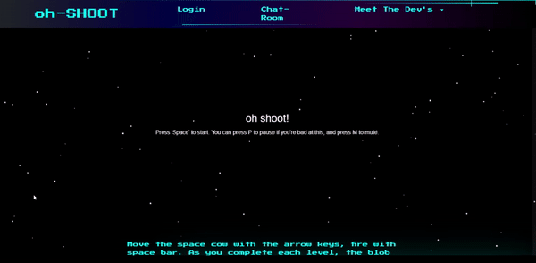

# oh-SHOOT

A website featuring an evil space blobfish and a non-air breathing cow in an epic battle in this space invaders archetype game. From keeping track of your highest scores to community chat interactions with like-minded gamers, this website has it all!

 
## Purpose
To create a Fullstack application that we as consumers of video games and fun, would use and be proud of.

## Built With
<li>
HandleBars
</li>
<li>
CSS
</li>
<li>
MYSQL
</li>
<li>
Node
</li>
<li>
JavaScript
</li>
<li>
CanvasRenderingContext2D
</li>
<li>
Bootstrap
</li>
<li>
HTML
</li>

## Link
Heroku Link : https://ohshoot.herokuapp.com/

## Demo

## Contribution
Made with love by https://github.com/AnukaZan
and https://github.com/CannibalClarence
